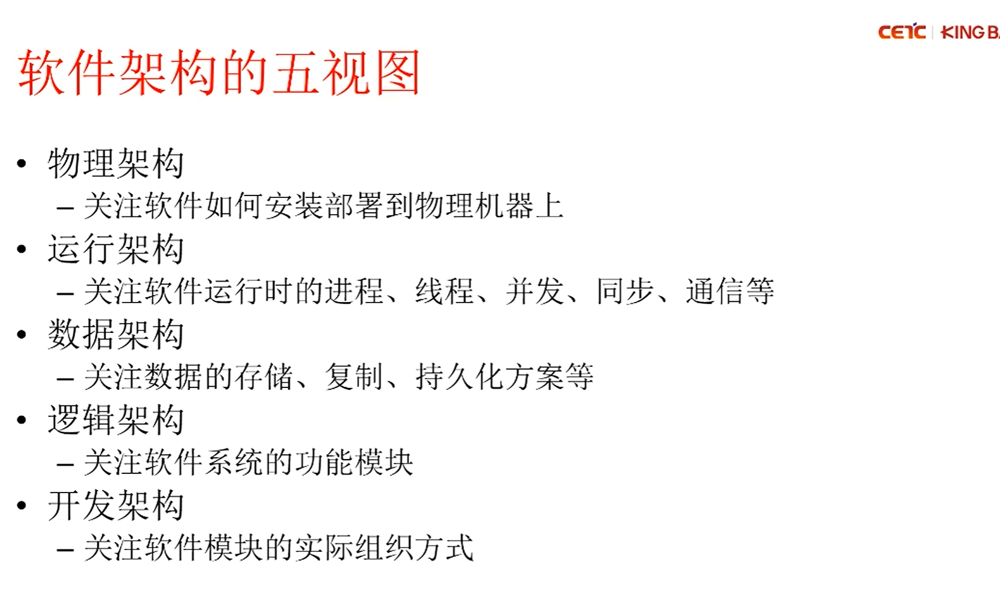

### 关于跨域问题的理解以及学习记录

#### 1.什么是跨域

在前端领域中，跨域是指浏览器允许向服务器发送跨域请求，从而克服Ajax只能**同源**使用的限制。

#### 2.js ts

**javascript**->**js**

**关系：** `js` 是前端开发的核心语言，也是运行在浏览器和 Node.js 后端的基本语言。

**概念：** 是一种高级的、解释型的、基于原型的、多范式的编程语言。它用于实现网页的交互性，以及现在通过 Node.js 实现了服务器端编程。

**特点：**

- **动态类型：** 变量的类型可以在运行时改变，这提供了很大的灵活性，但也容易引入运行时错误。
- **生态庞大：** 拥有世界上最大的开源库生态系统。
- **上手快：** 语法相对宽松，学习曲线相对平缓。

**缺点：** 缺乏强类型检查，对于大型复杂项目，代码维护性、可读性和协作性可能面临挑战。

**TypeScript**->**ts**

Ts is the superset of Js .Ts相比js提供了更多的支持，如面向对象

**关系：** `ts` 是 `js` 的**超集**，意味着任何合法的 `js` 代码都是合法的 `ts` 代码。它在 `js` 的基础上增加了**静态类型系统**。

**概念：** 由微软开发并维护的开源编程语言。它被设计用于大型应用开发，并最终编译为 `js`。

**特点：**

- **静态类型：** 在代码编写阶段（编译时）就能检查出类型错误，而不是等到运行时。这大大提高了代码的健壮性和可维护性。
- **更好的可读性和可维护性：** 类型定义使得代码意图更明确，易于理解和重构。
- **增强的开发工具支持：** IDE（如 VS Code）能够提供更精准的智能提示、自动补全、错误检测和代码重构功能。
- **面向对象特性：** 提供更完善的面向对象编程支持（接口、抽象类等）。
- **兼容性：** 最终编译成标准 `js`，因此可以运行在任何支持 `js` 的环境中。

